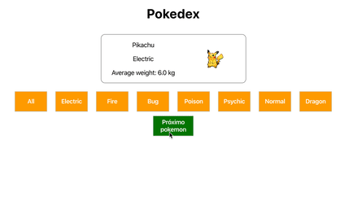

Esse é um projeto para o conteúdo de `Componentes com estado`.

### Antes de iniciar

Crie um fork desse projeto e para isso siga esse [tutorial de como realizar um fork](https://guides.github.com/activities/forking/).

Após feito o fork, clone o repositório criado para o seu computador.

Rode o `npm install`.

Vá para a branch master do seu projeto e execute o comando:

git branch

Mude para a branch pokedex-state com o comando git checkout -b pokedex-state. É nessa branch que você realizará a solução para o exercício.

Observe o que deve ser feito nas instruções.

Após a solução dos exercícios, abra um PR no seu repositório forkado e, se quiser, mergeie para a master, sinta-se a vontade!

**Atenção!** Quando for criar o PR você irá se deparar com essa tela:

É necessário realizar uma mudança. Clique no *base repository* como na imagem abaixo:

Mude para o seu repositório. Seu nome estará na frente do nome dele, por exemplo: `antonio/pokedex-state`. Depois desse passo a página deve ficar assim:

Agora basta criar o PULL REQUEST clicando no botão `Create Pull Request`.

Para cada PR realize esse processo.

### COMEÇANDO OS EXERCÍCIOS

Hoje você vai incrementar a sua Pokedex utilizando Estado. Caso você queira reutilizar a sua Pokedex de exercícios anteriores, basta substituir a pasta src desse repositório pela src da sua pokedex ja pronta após seguir os passos de `Antes de iniciar`.

Se você não tiver feito, sem problemas, aqui você ja vai encontrar o comportamento esperado da sua Pokedex após os últimos exercícios.

#### Exercício 1

- Altere a sua página para que, ao invés de exibir toda a lista de pokémons, ela exiba um pokémon por vez. Ao apertar um botão de Próximo pokémon, a página passa a exibir o próximo pokémon da lista, e depois o próximo, e assim sucessivamente. Ao se chegar ao último pokémon da lista, a pokedex deve voltar para o primeiro pokémon no apertar do botão. Dica: Lembre-se disso!

#### Exercício 2

- Sua pokedex deve ter dois botões contendo os tipos Fire e Psychic. A partir dessa seleção, a pokedex deve circular somente pelos pokémons daquele tipo. Quando a página carrega, um desses filtros deve estar selecionado.

#### Bônus

Agora que você pegou todos os pokémons, consegue pegar todos os bônus?! Não é fácil completar todos! Faça quantos conseguir.

- Separe os estilos de CSS por componente, fazendo um arquivo .css para cada.

- Sua pokedex deve ter um terceiro botão chamado All para resetar o filtro. Após clicá-lo, a pokedex deve voltar a circular por todos os pokémons. Quando a página carrega, o filtro selecionado deve ser o All.

- Crie um componente Button e use-o para fazer os botões reutilizáveis da sua Pokedex. Dica: pesquise sobre o this.props.children do React!

- Faça os botões de filtragem serem dinâmicos: sua pokedex deve gerar um botão de filtragem para cada tipo de pokémon disponível nos dados, independente de quais ou quantos sejam, sem repetição de tipos. Ou seja, se sua pokedex possui pokémons do tipo Fire, Psychic, Electric e Normal, deve aparecer como opção de filtro um botão para cada um desses tipos. Além disso, ela deve manter o botão All.

- Faça o botão de Próximo pokémon ser desabilitado se a lista filtrada de pokémons tiver um só pokémon.

Abaixo, um exemplo com todos os bônus feitos:

